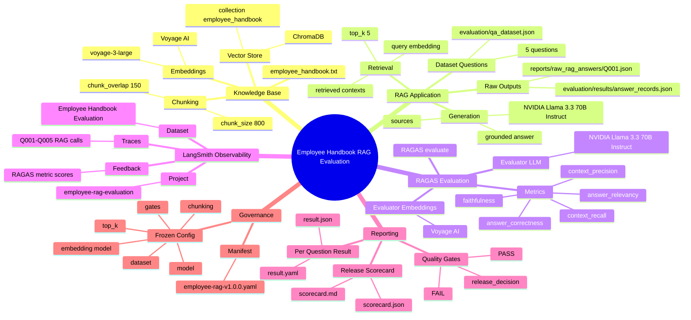
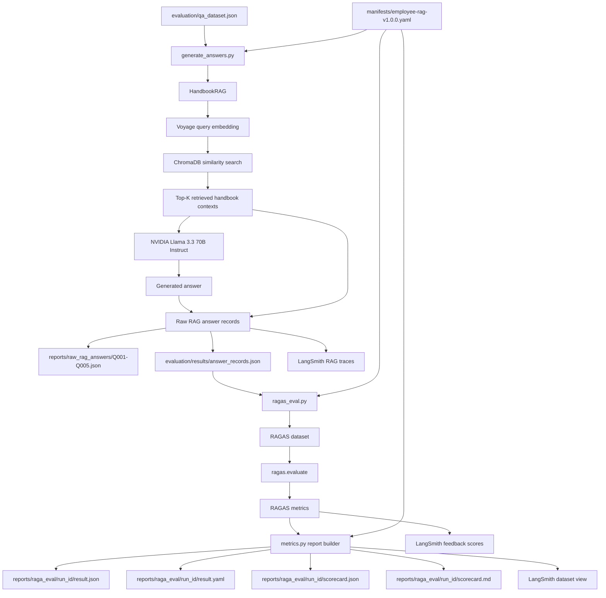
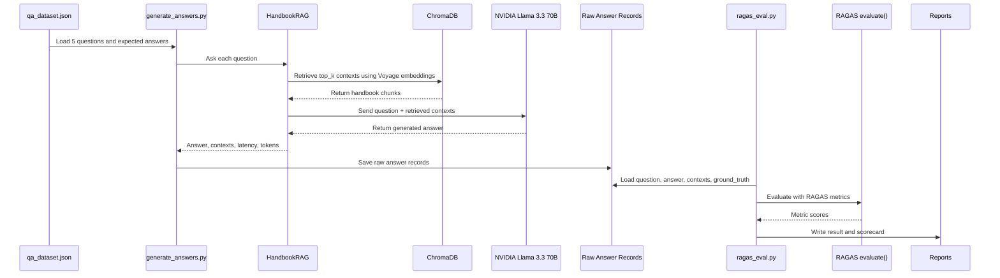
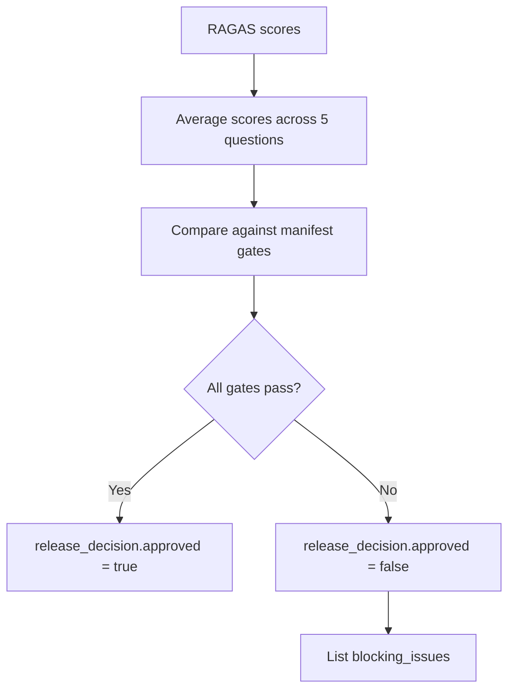

# RAGAS Evaluation Architecture

This document shows the end-to-end architecture for the employee handbook RAG evaluation pipeline.

## System Mindmap



## End-to-End Flow



## Runtime Sequence



## RAGAS Dataset Mapping

Before calling RAGAS, raw answer records are converted into the RAGAS 0.4.x schema:

```text
question     -> user_input
answer       -> response
contexts     -> retrieved_contexts
ground_truth -> reference
```

## Metric Mapping

```text
RAGAS context_precision  -> retrieval.context_precision
RAGAS context_recall     -> retrieval.context_recall
RAGAS faithfulness       -> generation.faithfulness
RAGAS answer_relevancy   -> generation.response_relevance
RAGAS answer_correctness -> rag_system.completeness
1 - faithfulness         -> rag_system.hallucination_rate
```

## Report Structure

```text
reports/
├── raw_rag_answers/
│   ├── Q001.json
│   ├── Q002.json
│   ├── Q003.json
│   ├── Q004.json
│   └── Q005.json
│
└── raga_eval/
    └── run-YYYYMMDDTHHMMSSZ/
        ├── result.json
        ├── result.yaml
        ├── scorecard.json
        └── scorecard.md
```

## LangSmith Dashboard

LangSmith is the visualization layer for the same evaluation artifacts.

```text
RAG trace -> RAGAS feedback scores -> dataset view -> dashboard inspection
```

For setup and dashboard details, see [LANGSMITH_DASHBOARD.md](LANGSMITH_DASHBOARD.md).

## Release Decision Logic



Quality gates are read from:

```text
manifests/employee-rag-v1.0.0.yaml
```

Current gate rules:

```text
context_relevance >= min_context_relevance
faithfulness >= min_faithfulness
response_relevance >= min_response_relevance
completeness >= min_completeness
hallucination_rate <= max_hallucination_rate
```
