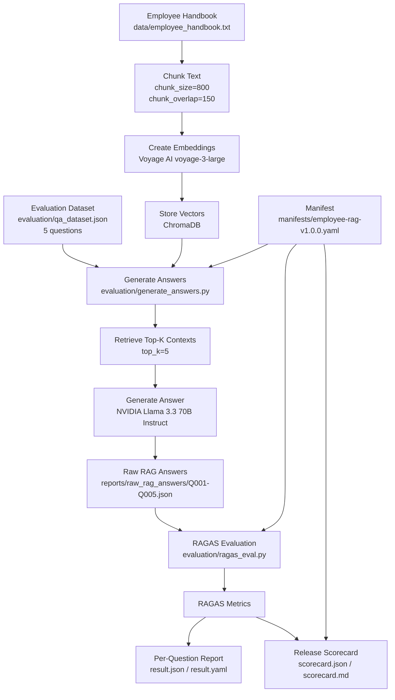
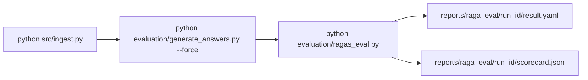

# Simple RAGAS Evaluation Flow

This is the high-level flow of the project without LangSmith.

## One-Page Flow



## What Each Step Does

```text
1. Ingest handbook
   Converts employee_handbook.txt into chunks and stores embeddings in ChromaDB.

2. Generate raw RAG answers
   Runs each dataset question through the real RAG system.

3. Save raw answer files
   Stores question, generated answer, retrieved contexts, ground truth, latency, and tokens.

4. Run RAGAS
   Evaluates question + answer + contexts + ground truth using real RAGAS metrics.

5. Generate reports
   Writes per-question result files and an overall scorecard.
```

## Command Flow



## RAGAS Metric Mapping

```text
context_precision  -> retrieval.context_precision
context_recall     -> retrieval.context_recall
faithfulness       -> generation.faithfulness
answer_relevancy   -> generation.response_relevance
answer_correctness -> rag_system.completeness
1 - faithfulness   -> rag_system.hallucination_rate
```

## Final Output

```text
reports/
├── raw_rag_answers/
│   ├── Q001.json
│   ├── Q002.json
│   ├── Q003.json
│   ├── Q004.json
│   └── Q005.json
│
└── raga_eval/
    └── run-YYYYMMDDTHHMMSSZ/
        ├── result.json
        ├── result.yaml
        ├── scorecard.json
        └── scorecard.md
```
